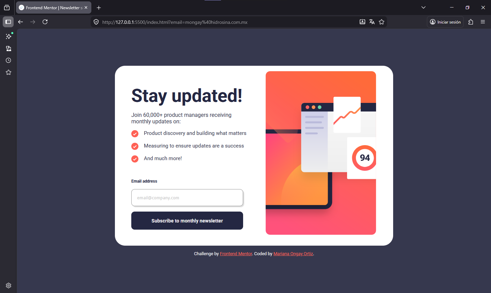
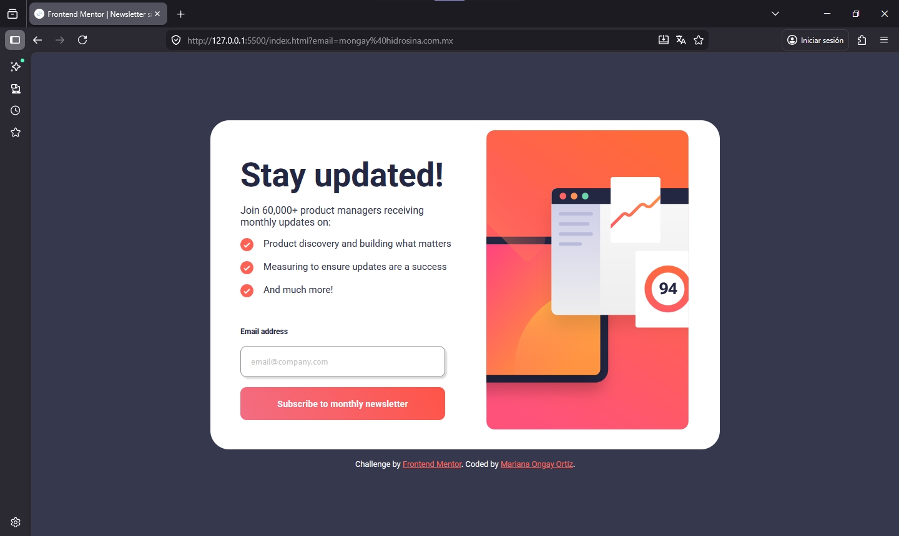
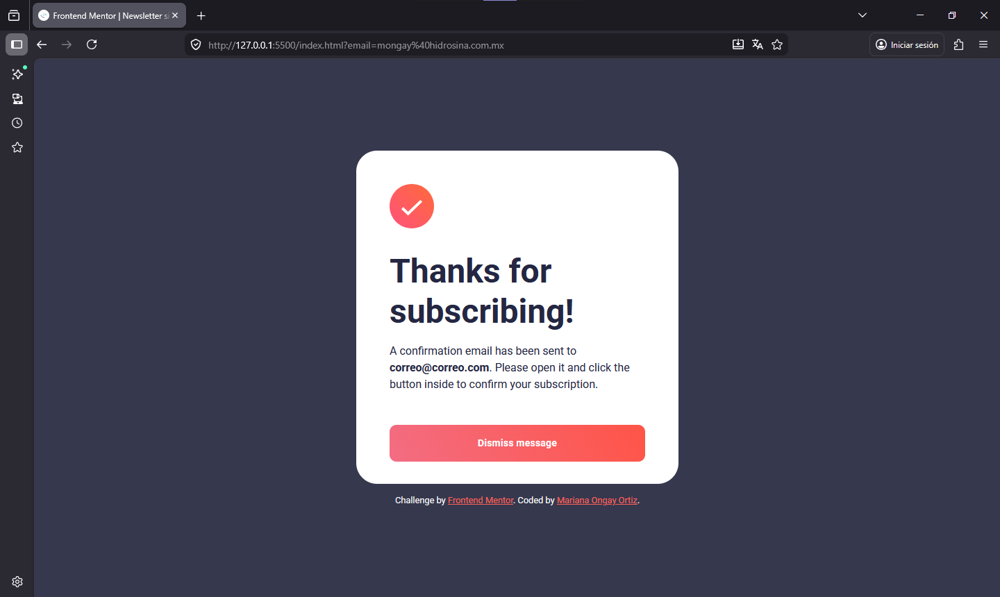
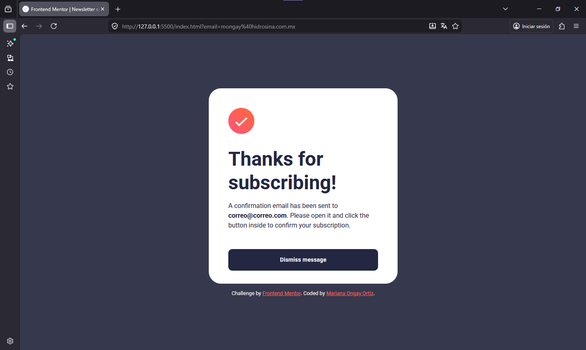
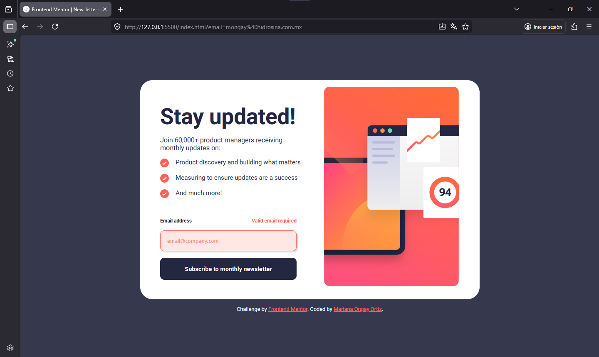
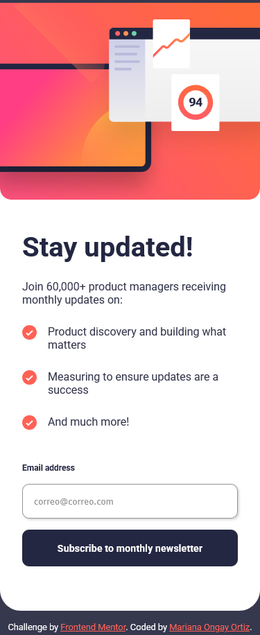
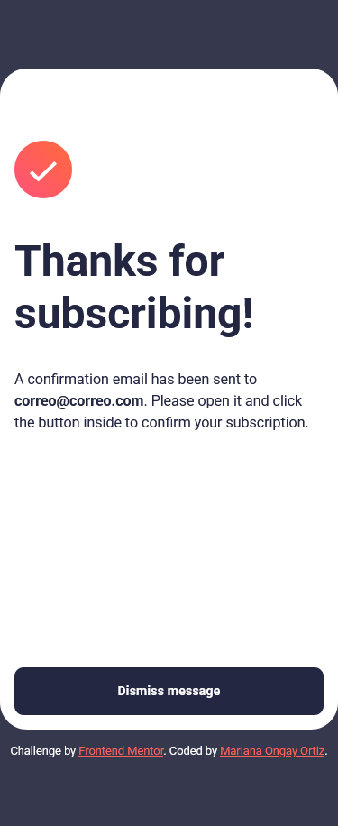

# Frontend Mentor - Newsletter sign-up form with success message solution

Solución de [Newsletter sign-up form with success message challenge on Frontend Mentor](https://www.frontendmentor.io/challenges/newsletter-signup-form-with-success-message-3FC1AZbNrv).  

### Screenshot
Diseño desktop

Diseño desktop active state

Diseño desktop success

Diseño errores

Diseño movil

Diseño movil success

### Comandos

    npm install

    npm install -g sass

    sass scss/styles.scss css/styles.css

    sass --watch scss:css

## Author

- Website - Mariana Ongay Ortiz
- Frontend Mentor - [@MarianaOngay17](https://www.frontendmentor.io/profile/MarianaOngay17)
